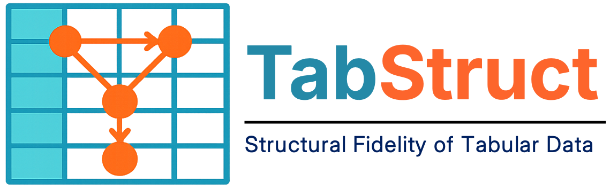

# [ICLR 2026 Oral] TabStruct – Tabular Structural Fidelity

<div align="center">



[](https://arxiv.org/abs/2509.11950)
[](https://silencex12138.github.io/TabStruct/)
[](https://github.com/SilenceX12138/TabStruct/actions/workflows/style_check.yaml)
[](https://pypi.org/project/tabstruct/)
[](LICENSE)

</div>

> [!IMPORTANT]
> Official code for the paper ["TabStruct: Measuring Structural Fidelity of Tabular Data"](https://arxiv.org/abs/2509.11950), published in The Fourteenth International Conference on Learning Representations (ICLR 2026 Oral).
>
> TabStruct provides a shared experimental pipeline for tabular generation, predictive modelling, and evaluation of structural fidelity.
>
> Authored by [Xiangjian Jiang](https://silencex12138.github.io/), [Nikola Simidjievski](https://simidjievskin.github.io/), and [Mateja Jamnik](https://www.cl.cam.ac.uk/~mj201/), University of Cambridge, UK.

## 📌 Overview

**TabStruct** is an end‑to‑end benchmark for **tabular data generation, prediction, and evaluation**. It ships with ready‑to‑use pipelines for

- **generating** high‑quality synthetic tables,
- **predicting** with machine learning models, and
- **analysing** results with a rich suite of metrics – especially those that quantify **structural fidelity**.

The benchmark is designed for both research and applied workflows: you can run standard baselines out of the box, or plug in custom generators/predictors and fairly evaluate them under the same protocol.
All components are designed to plug‑and‑play, so you can mix, match, and extend them to suit your own workflow.


## 📚 Key Features

- **Generate tables:** SMOTE, CTGAN, TVAE, Bayesian networks, ARF, normalizing flows, diffusion models, and additional registered wrappers.
- **Evaluate synthetic data:** density estimation, privacy preservation, ML efficacy, and structural fidelity.
- **Predict:** classification and regression with linear models, random forests, KNN, XGBoost, neural networks, TabPFN, and TabFORGE adapters.
- **Compare consistently:** shared dataset loading, split IDs, preprocessing, saved CSVs/checkpoints, W&B summaries, and Optuna tuning.

### 📐 Evaluation dimensions

- **Density estimation** – How well does the synthetic data approximate the real distribution?
- **Privacy preservation** – Does the generator leak sensitive records?
- **ML efficacy** – How do models trained on synthetic data perform compared to real data?
- **Structural fidelity** – Does the generator respect the causal structures of real data?

The [model reference](docs/wiki/reference/models.rst) lists current registry identifiers and dependencies. The registry extends beyond the models evaluated in the paper.

## 🚀 Installation

Use **Python 3.10 or later**, and run commands from a Git checkout of the public repository. The runtime locates its output directory through the checkout's `.git` directory.

```bash
git clone https://github.com/SilenceX12138/TabStruct.git
cd TabStruct
conda create -n tabstruct python=3.10.18
conda activate tabstruct
bash scripts/utils/install.sh
```

For an already prepared environment, `python -m pip install -e .` installs the checkout in editable mode; individual generators may need additional packages. See [Getting started](docs/wiki/guide/quickstart.rst) for requirements and CPU execution.

## 📊 Logging with W&B

Configure your W&B entity and project in `src/tabstruct/common/__init__.py`, then authenticate with `wandb login`. Logging is online by default; `--disable_wandb` disables it for a local check.

## ✅ Quick sanity check

Train and save a linear classifier on the Credit dataset:

```bash
python -m src.tabstruct.experiment.run_experiment \
  --pipeline prediction \
  --task classification \
  --model lr \
  --dataset credit-g \
  --device cpu \
  --save_model \
  --tags tutorial-prediction
```

[**TabCamel**](https://github.com/SilenceX12138/TabCamel) loads the named dataset, so the first run may download data. The runner reports metrics for the training, validation, and test splits. Saved models are written to `logs/<configured-project>/<run-id>/lr.pkl`, and W&B records the path as `best_model_path`.

`--task`, `--model`, and `--dataset` are required. Validation is split from the rows remaining after the test split: the default `--test_size 0.2 --valid_size 0.1` gives approximately 72% training, 8% validation, and 20% test data.

## 💥 Example Workflows: Generate and evaluate synthetic data

Generate a classification table without running the metric suite:

```bash
bash docs/tutorial/example_scripts/generation/train.sh
```

The runner saves `synthetic_samples.csv` in the run directory and records `generated_data_path`. Pass that file to the evaluation tutorial:

```bash
bash docs/tutorial/example_scripts/generation/eval.sh \
  logs/<configured-project>/<run-id>/synthetic_samples.csv
```

This enables structural fidelity evaluation with `--enable_eval_structure`. [**TabEval**](https://github.com/SilenceX12138/TabEval) evaluates the synthetic table, while a separate prediction run on synthetic training rows measures ML efficacy. See the [evaluation guide](docs/wiki/guide/evaluation.rst) for all four dimensions, split behavior, and evaluator configuration.

## 📖 Documentation

| Start here | Contents |
| --- | --- |
| [Getting started](docs/wiki/guide/quickstart.rst) | Install, configure logging, run and restore a model |
| [Overview](docs/wiki/guide/overview.rst) | Public modules and implemented workflow |
| [Data and preprocessing](docs/wiki/guide/data.rst) | Dataset schema, split semantics, curation, transforms |
| [Workflows](docs/wiki/guide/workflows.rst) | Generation, prediction, checkpoints, tuning |
| [Evaluation](docs/wiki/guide/evaluation.rst) | Four evaluation dimensions and TabEval integration |
| [Tutorials](docs/wiki/guide/tutorials.rst) | Complete scripts and expected outputs |
| [CLI](docs/wiki/reference/cli.rst) · [API](docs/wiki/reference/api.rst) · [Models](docs/wiki/reference/models.rst) | Supported flags, interfaces, identifiers |
| [Developer guide](docs/wiki/guide/development.rst) | Add a model and build the public documentation |

## 📖 Citation

```bibtex
@inproceedings{jiang2026tabstruct,
  title={TabStruct: Measuring Structural Fidelity of Tabular Data},
  author={Jiang, Xiangjian and Simidjievski, Nikola and Jamnik, Mateja},
  booktitle={The Fourteenth International Conference on Learning Representations},
  year={2026}
}

@inproceedings{jiang2025well,
  title={How Well Does Your Tabular Generator Learn the Structure of Tabular Data?},
  author={Jiang, Xiangjian and Simidjievski, Nikola and Jamnik, Mateja},
  booktitle={ICLR 2025 Workshop on Deep Generative Model in Machine Learning: Theory, Principle and Efficacy},
  year={2025}
}
```
