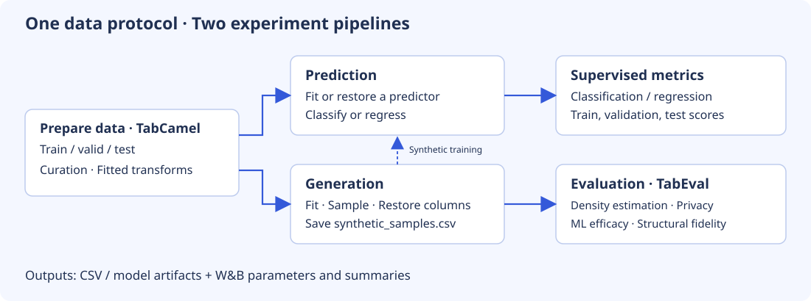

Overview
========

TabStruct provides two experiment pipelines: **prediction** for classification
and regression, and **generation** for synthetic tables and their evaluation.
The shared runtime fixes seeds, prepares data, selects a registered model,
and records metrics and artifacts.

   This diagram describes the current implementation rather than a neural
   network architecture.

Key components
--------------

.. list-table:: Public implementation
   :header-rows: 1
   :widths: 36 64

   * - Module under ``src/tabstruct/``
     - Responsibility
   * - ``experiment/run_experiment.py``
     - CLI and Python experiment entry point.
   * - ``common/runtime/config/``
     - Argument parsing, interactions, seed and device setup.
   * - ``common/data/``
     - TabCamel loading, splits, curation, preprocessing, and ``DataModule``.
   * - ``common/model/``
     - Shared model lifecycle, helper orchestration, and pickle persistence.
   * - ``prediction/models/``
     - Predictor adapters and supervised metric computation.
   * - ``generation/models/``
     - Generator adapters, synthetic CSV output, and TabEval integration.
   * - ``experiment/pipeline/``
     - Selects the generation or prediction helper.
   * - ``experiment/tune/``
     - Optuna parameter search over repeated splits.

Data lifecycle
--------------

``DataHelper`` loads a named dataset through **TabCamel**, removes constant
features, splits test rows first and validation rows second, then applies
optional training-data curation. Feature and target transforms are fitted
using training data and applied to the other splits. ``DataModule`` exposes
DataFrames, array views, and Lightning dataloaders.

For generation, synthetic samples are restored to the original column space
before CSV export. Evaluation constructs its own original, one-hot, and ordinal
views; it does not reuse a generator's private encoding as the metric space.

Metrics
-------

TabStruct considers four dimensions: **density estimation**, **privacy
preservation**, **ML efficacy**, and **structural fidelity**. **TabEval**
supplies the synthetic-data evaluators. The prediction pipeline measures ML
efficacy when its training split is replaced with synthetic rows.

The paper calls the structural metric **global utility**; the current runner
dispatches structural evaluation through TabEval's ``UtilityPerFeature`` class.
See :doc:`evaluation` for the configured evaluators and split policy.

W&B
---

W&B entity/project constants live in ``src/tabstruct/common/__init__.py``.
Local data and model artifacts are saved under ``logs/<configured-project>/``;
W&B stores the corresponding paths in run summaries. A path recorded online
still needs to exist on the machine restoring or evaluating the artifact.

The :doc:`../reference/models` registry describes the current checkout.
Reproducing a paper result also requires its dataset, evaluation settings,
predictor ensemble, and aggregation protocol.
