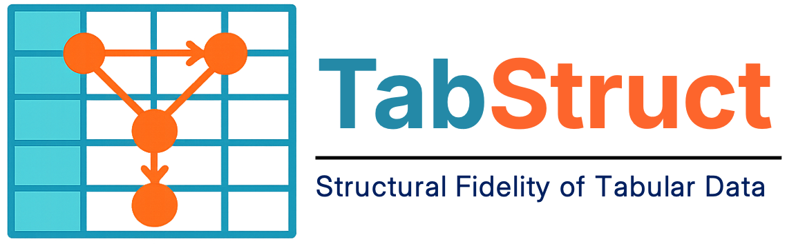

TabStruct - Tabular Structural Fidelity
=======================================================

.. |arxiv| image:: https://img.shields.io/badge/Arxiv-Paper-olivegreen?style=for-the-badge
   :target: https://arxiv.org/abs/2509.11950

.. |ci| image:: https://img.shields.io/github/actions/workflow/status/SilenceX12138/TabStruct/style_check.yaml?branch=master&style=for-the-badge
   :target: https://github.com/SilenceX12138/TabStruct/actions/workflows/style_check.yaml?branch=master

.. |pypi| image:: https://img.shields.io/pypi/v/tabstruct?style=for-the-badge
   :target: https://badge.fury.io/py/tabstruct

.. |downloads| image:: https://img.shields.io/pepy/dt/tabstruct?style=for-the-badge
   :target: https://pypi.org/project/tabstruct/

.. |license| image:: https://img.shields.io/badge/License-Apache%202.0-blue.svg?style=for-the-badge
   :target: https://opensource.org/licenses/Apache-2.0

|arxiv| |ci| |pypi| |downloads| |license|

.. important::

   Official code for the paper "TabStruct: Measuring Structural Fidelity of Tabular Data" (https://arxiv.org/abs/2509.11950),
   published in The Fourteenth International Conference on Learning Representations (ICLR 2026 Oral).

   Authored by Xiangjian Jiang, Nikola Simidjievski, and Mateja Jamnik, University of Cambridge, UK.

Overview
--------

**TabStruct** is an end-to-end benchmark for **tabular data generation, prediction, and evaluation**.
It ships with ready-to-use pipelines for:

* generating high-quality synthetic tables
* training predictive models
* analysing results with a rich suite of metrics, especially those that quantify **structural fidelity**

All components are designed to plug-and-play, so you can mix, match, and extend them to suit your own workflow.

Key Features
------------

Data generation
~~~~~~~~~~~~~~~

* Out-of-the-box support for popular tabular generators: **SMOTE, TVAE, CTGAN, NFlow, TabDDPM, ARF**, and more.

Evaluation dimensions
~~~~~~~~~~~~~~~~~~~~~

* **Density estimation** - How well does the synthetic data approximate the real distribution?
* **Privacy preservation** - Does the generator leak sensitive records?
* **ML efficacy** - How do models trained on synthetic data perform compared to real data?
* **Structural fidelity** - Does the generator respect the causal structures of real data?

Predictive tasks
~~~~~~~~~~~~~~~~

* Classification and regression pipelines built on **scikit-learn**, with optional neural-network backbones.

Installation
------------

We recommend managing dependencies with **conda** + **mamba**.

.. code-block:: bash

   # 1. Upgrade conda and activate the base env
   conda update -n base -c conda-forge conda
   conda activate base

   # 2. Install the high-performance dependency resolver
   conda install conda-libmamba-solver --yes
   conda config --set solver libmamba
   conda install -c conda-forge mamba --yes

   # 3. Create a new conda env
   conda create --name tabstruct python=3.10.18 --no-default-packages
   conda activate tabstruct

   # 4. Set up the env
   bash scripts/utils/install.sh

Logging with W&B
----------------

TabStruct logs every experiment to **Weights & Biases** (W&B).
Use the default project or set your own credentials in ``src/tabstruct/common/__init__.py``:

.. code-block:: python

   WANDB_ENTITY  = "tabular-data-generation"
   WANDB_PROJECT = "TabStruct"

Quick sanity check
------------------

Run a toy classification job (K-NN on the Adult dataset):

.. code-block:: bash

   python -m src.tabstruct.experiment.run_experiment \
     --model knn \
     --save_model \
     --dataset adult \
     --test_size 0.2 \
     --valid_size 0.1 \
     --tags ENV-TEST

A successful run prints a series of green log lines like:

.. code-block:: text

   [YYYY-MM-DD] Codebase: >>>>>>>>>> Launching create_data_module() <<<<<<<<<<<
   ...

If you see those, your environment is ready.

Example Workflows
-----------------

1. Generate synthetic data
~~~~~~~~~~~~~~~~~~~~~~~~~~

.. code-block:: bash

   python -m src.tabstruct.experiment.run_experiment \
       --pipeline "generation" \
       --generation_only \
       --model "smote" \
       --dataset "mfeat-fourier" \
       --test_size 0.2 \
       --valid_size 0.1 \
       --tags "dev"

Template script: ``docs/tutorial/example_scripts/generation/train.sh``.

2. Evaluate synthetic data
~~~~~~~~~~~~~~~~~~~~~~~~~~

.. code-block:: bash

   python -m src.tabstruct.experiment.run_experiment \
       --pipeline "generation" \
       --model "smote" \
       --eval_only \
       --dataset "mfeat-fourier" \
       --test_size 0.2 \
       --valid_size 0.1 \
       --generator_tags "dev" \
       --tags "dev"

Template script: ``docs/tutorial/example_scripts/generation/eval.sh``.

3. Predict on tabular data
~~~~~~~~~~~~~~~~~~~~~~~~~~

.. code-block:: bash

   python -m src.tabstruct.experiment.run_experiment \
       --model "mlp" \
       --save_model \
       --max_steps_tentative 1500 \
       --dataset "adult" \
       --test_size 0.2 \
       --valid_size 0.1 \
       --tags "dev"

Template script: ``docs/tutorial/example_scripts/prediction/train.sh``.

Citation
--------

For attribution in academic contexts, please cite this work as:

.. code-block:: bibtex

   @inproceedings{jiang2026tabstruct,
     title={TabStruct: Measuring Structural Fidelity of Tabular Data},
     author={Jiang, Xiangjian and Simidjievski, Nikola and Jamnik, Mateja},
     booktitle={The Fourteenth International Conference on Learning Representations},
     year={2026}
   }

   @inproceedings{jiang2025well,
     title={How Well Does Your Tabular Generator Learn the Structure of Tabular Data?},
     author={Jiang, Xiangjian and Simidjievski, Nikola and Jamnik, Mateja},
     booktitle={ICLR 2025 Workshop on Deep Generative Model in Machine Learning: Theory, Principle and Efficacy}
   }

Contents
--------

.. toctree::
   :maxdepth: 2
   :caption: Guide

   guide/overview
   guide/quickstart

.. toctree::
   :maxdepth: 2
   :caption: Reference

   reference/api
   reference/cli
   reference/models

